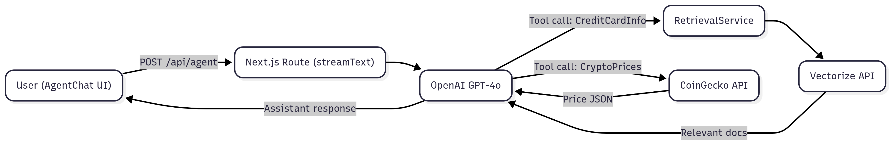

# Finance AI Assistant

> An AI-powered financial assistant built with **Next.js App Router**, **@ai-sdk/react**, **Vectorize.io**, and **Model Context Protocol (MCP)**. Ask about cryptocurrency prices, stock market data, credit-card products, or general finance topics and get authoritative, multi-language answers enriched with live data and retrieved documents.

---

## ✨ Key Features

• **Conversational Agent** – Powered by OpenAI `gpt-4o-mini` via `@ai-sdk`, with tool-calling for dynamic data lookup.  
• **Stock Market Data** – Real-time stock prices, financial statements, market reports via **Smithery MCP Server**.  
• **Cryptocurrency Tracking** – Live crypto prices from the CoinGecko API.  
• **Contextual Retrieval** – Searches your private knowledge base through Vectorize pipelines to ground responses.  
• **Multi-language** – Detects the user language automatically and answers in the same language.  
• **MCP Integration** – Leverages Model Context Protocol for seamless tool orchestration.  
• **Rich UI** – Tailwind-powered chat interface with typing indicators, tool execution logs, and source citations.

---

## ⚙️ How It Works

1. **User sends a message** from `components/agent-chat.tsx`.
2. The message is POSTed to **`/api/agent`** where we invoke `streamText` from **@ai-sdk**.
3. **MCP Client** connects to Smithery's stock market server for real-time financial data.
4. The assistant may decide to call one of several _tools_:

   **Stock Market Tools (via MCP):**
   • `get_ticker_price` → Get current stock prices for any ticker symbol  
   • `get_financial_statement` → Retrieve financial statements for companies  
   • `get_market_report` → Generate comprehensive US market reports  
   • `get_company_overview` → Get company overviews and key metrics

   **Local Tools:**
   • `getBancoPichinchaCreditCardsInfo` → Uses `RetrievalService` → `VectorizeService` → Vectorize API  
   • `getCryptoPrices` → Direct call to the CoinGecko REST API

5. Tool results are streamed back to the model as function results, allowing the model to craft a grounded response.
6. The final assistant message, along with structured tool call data, is streamed to the frontend and rendered in the chat.
7. **MCP Client cleanup** ensures proper resource management after each request.

---

## 🖼️ Architecture Flow Chart



---

## 🔧 MCP Integration Details

### **Smithery Stock Market Server**

- **Server URL**: `https://server.smithery.ai/@MCP-100/stock-market-server`
- **Transport**: StreamableHTTPClientTransport
- **Provider**: Alpha Vantage API
- **Features**: Real-time stock data, financial statements, market reports
- **Documentation**: [Smithery Stock Market Server](https://smithery.ai/server/@MCP-100/stock-market-server)
- **Repository**: [MCP-100/stock-market-server](https://github.com/MCP-100/stock-market-server)

### **Error Handling & Optimization**

- **Token Management**: Responses truncated to prevent OpenAI token limits
- **Graceful Fallback**: Continues operation if MCP server is unavailable
- **Connection Cleanup**: Automatic MCP client closure after requests
- **Multi-step Execution**: Up to 3 tool execution steps per conversation

---

## 📁 Important Modules

| Path                        | Responsibility                                                                   |
| --------------------------- | -------------------------------------------------------------------------------- |
| `app/api/agent/route.ts`    | Defines streaming chat endpoint, MCP client, system prompt, and tool definitions |
| `components/agent-chat.tsx` | Front-end chat widget that streams responses and visualises tool calls           |
| `lib/retrieval.ts`          | Wraps `VectorizeService` to format retrieved documents for the LLM               |
| `lib/vectorize.ts`          | Thin client around Vectorize REST API for semantic search                        |
| `types/*`                   | Shared TypeScript interfaces for vectorize docs and chat sources                 |
| `lib/consts.ts`             | List of whimsical loading messages for the UI                                    |
| `lib/utils.ts`              | Tailwind-merge helper `cn`                                                       |

---

## 🛠️ Getting Started

```bash
# 1. Install dependencies
pnpm install  # or npm / yarn / bun

# 2. Set environment variables (see below)
cp .env.example .env.local && $EDITOR .env.local

# 3. Run the dev server
pnpm dev
```

Open <http://localhost:3000> and start chatting! 🚀

### Required Environment Variables

| Variable                          | Description                              |
| --------------------------------- | ---------------------------------------- |
| `OPENAI_API_KEY`                  | Your OpenAI key used by `@ai-sdk`        |
| `VECTORIZE_PIPELINE_ACCESS_TOKEN` | Secret token for your Vectorize pipeline |
| `VECTORIZE_ORGANIZATION_ID`       | Vectorize organization id                |
| `VECTORIZE_PIPELINE_ID`           | Pipeline id containing your finance docs |

> _Note:_ MCP server connection is handled automatically. You can retrieve Vectorize IDs from the dashboard under **Settings → API**.

---

## 📝 Example Prompts

### Stock Market Queries

```text
What's the current price of Apple stock?

Get Tesla's latest financial statements

Generate a market report for today

Show me Microsoft's company overview and key metrics
```

### Cryptocurrency Queries

```text
¿Cuánto cuesta 1 BTC y 2 ETH en USD ahora mismo?

What are the current prices for bitcoin, ethereum, and cardano?
```

### Banking & Credit Cards

```text
¿Cuál es la mejor tarjeta de crédito de Banco Pichincha para acumular millas?

Recomiéndame una estrategia para ahorrar dinero si mi ingreso mensual es de $1500.
```

### Multi-language Support

```text
Explique-moi les actions Apple en français

Dime el precio actual de las acciones de Google en español
```

---

## 🚀 Deployment

The app is zero-config on **Vercel**:

1. Push your repo.
2. Add the environment variables in the Vercel dashboard.
3. Profit 🎉

### Performance Optimizations

- **Model**: Uses `gpt-4o-mini` for cost efficiency and speed
- **Token Limits**: `maxTokens: 1000` to prevent rate limiting
- **Response Truncation**: Large responses automatically truncated to 2000 characters
- **Connection Pooling**: MCP clients properly managed per request

---

## 🔧 Available Tools

### 📈 Stock Market Tools (MCP)

| Tool                      | Description                            | Parameters                                                              |
| ------------------------- | -------------------------------------- | ----------------------------------------------------------------------- |
| `get_ticker_price`        | Get current price for a stock ticker   | `symbol: string` (e.g., "AAPL", "TSLA")                                 |
| `get_market_report`       | Generate US market report/briefing     | None                                                                    |
| `get_financial_statement` | Get financial statements for a company | `symbol: string`, `statement: string` ("income", "balance", "cashflow") |
| `get_company_overview`    | Get company overview and key metrics   | `symbol: string` (stock ticker symbol)                                  |

**Example Usage:**

```typescript
// Get Apple's current stock price
get_ticker_price({ symbol: 'AAPL' });

// Get Tesla's income statement
get_financial_statement({ symbol: 'TSLA', statement: 'income' });

// Generate market report
get_market_report({});

// Get Microsoft company overview
get_company_overview({ symbol: 'MSFT' });
```

### 💰 Cryptocurrency Tools

| Tool              | Description                      | Parameters                           |
| ----------------- | -------------------------------- | ------------------------------------ |
| `getCryptoPrices` | Get crypto prices from CoinGecko | `ids: string[]`, `currency?: string` |

### 🏦 Banking Tools

| Tool                               | Description                    | Parameters      |
| ---------------------------------- | ------------------------------ | --------------- |
| `getBancoPichinchaCreditCardsInfo` | Search credit card information | `query: string` |

---

## 🧪 Testing MCP Integration

To verify the MCP connection is working:

1. Check the console logs for: `"Successfully connected to Smithery stock market server"`
2. Look for available tools: `"Available MCP tools: ['get_ticker_price', ...]"`
3. Test with a simple query like: `"What's Apple's stock price?"`

### Sample Responses

**Stock Price Query:**

```json
{
  "symbol": "AAPL",
  "price": "150.25",
  "change": "+2.15",
  "changePercent": "+1.45%",
  "lastUpdated": "2024-01-15T16:00:00Z"
}
```

**Financial Statement Query:**

```json
{
  "symbol": "TSLA",
  "statement": "income",
  "data": {
    "totalRevenue": "96773000000",
    "netIncome": "5519000000"
    // ... more financial data
  }
}
```

> **Note**: Alpha Vantage API access is provided by Smithery - no additional API key required.

### Troubleshooting MCP Connection

**Common Issues:**

1. **"Failed to connect to MCP server"**

   - Check internet connectivity
   - Verify the Smithery server is operational
   - The app will continue with local tools only

2. **"ToolInvocation must have a result"**

   - Ensure `maxSteps` is set properly (currently: 3)
   - Check MCP client isn't being closed too early
   - Verify tool parameters are correctly formatted

3. **Token limit exceeded**
   - Responses are automatically truncated to 2000 chars
   - Using `gpt-4o-mini` for better token efficiency
   - `maxTokens: 1000` limit in place

---

## 🤝 Contributing

1. Fork the repo & create a feature branch.
2. Follow the existing ESLint & Prettier rules.
3. Test MCP connectivity before submitting PRs.
4. Open a pull request – all PRs are welcome!

---

## 📚 Learn More

- [AI SDK Documentation](https://ai-sdk.dev/docs)
- [Model Context Protocol](https://modelcontextprotocol.io/)
- [Smithery MCP Registry](https://smithery.ai/)
- [Vectorize.io Documentation](https://vectorize.io/docs)

---

## 📄 License

MIT © 2024 Alex
